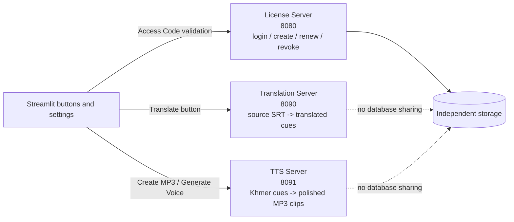

# AI KHEMRA BRO Service Architecture

## Ownership rule

Each server owns one responsibility only. No service calls another service directly. Streamlit is the orchestrator and the only component allowed to call the services.



## Server boundaries

| Service | Port | Owns | Must not own | Secret | Main endpoint |
|---|---:|---|---|---|---|
| License Server | 8080 | Access Code creation, validation, renewal, revocation, expiry | Translation, TTS, video files | `LICENSE_ADMIN_KEY`, `LICENSE_SERVICE_KEY`, `LICENSE_PEPPER` | `/v1/licenses/*` |
| Translation Server | 8090 | Ordered source cues to target-language cues | Login, license state, audio rendering | `TRANSLATION_API_KEY`, `GEMINI_API_KEY` | `/v1/translate` |
| TTS Server | 8091 | Khmer voice synthesis and audio polish | Translation, license state, SRT translation | `TTS_API_KEY` | `/v1/synthesize` |
| Streamlit | 8501 | UI, upload, settings, orchestration, final download | Owning license/translation/TTS databases | service URLs and service keys | UI buttons |

Ports are bound to localhost in the provided Compose files. Public access should go through HTTPS/reverse proxy, never by exposing the internal ports directly.

## Button routing contract

| Streamlit control | Exactly one owner | Request | Result |
|---|---|---|---|
| Login | License Server | customer name + Access Code | valid customer + expiry |
| Owner: Create Code | License Server | customer + term | new Code + expiry |
| Owner: Renew/Revoke | License Server | license ID + term/action | updated license state |
| Generate Khmer SRT | Translation Server (after local Whisper transcription) | ordered source cues, target language, style, model | ordered translated cues |
| Translate to Khmer | Translation Server | ordered source SRT cues, target language, style, model | ordered translated cues |
| Create MP3 | TTS Server | Khmer cues + four voice tags | polished audio clips / final audio adapter |
| Generate Voice | TTS Server | one Khmer text + one voice tag | polished MP3 |

The Translation Server never creates audio. The TTS Server never translates text. The License Server never receives subtitle or audio content.

## Current vs target mode

### Current repository mode

The three standalone servers are packaged and independently runnable, but the current Streamlit app still uses its local license database, direct Gemini translation path, and local Edge TTS path. This is intentional until real service URLs and private keys are installed.

### Target production mode

Set these private Streamlit secrets only after deploying and health-checking the services:

```toml
LICENSE_SERVICE_URL = "https://license.example.com"
LICENSE_SERVICE_KEY = "..."
TRANSLATION_SERVICE_URL = "https://translate.example.com"
TRANSLATION_SERVICE_KEY = "..."
TTS_SERVICE_URL = "https://tts.example.com"
TTS_SERVICE_KEY = "..."
```

The integration must be feature-flagged: if a service URL/key pair is incomplete, the related button must show a clear configuration error rather than silently sending work to the wrong service. A configured service failure must not silently fall back to another service, because that hides production routing mistakes.

## Operational isolation

- Separate Docker Compose project and restart policy for each service.
- Separate API key for each service; never reuse the License key for Translation or TTS.
- Separate logs and health checks.
- License database volume is used only by License Server.
- Translation Server is stateless; Gemini credentials remain server-side.
- TTS Server is stateless; temporary audio is deleted after the response.
- Streamlit owns only UI state and its existing project temporary files.

## Readiness checklist

- [x] Independent source directories and Dockerfiles.
- [x] Independent ports: 8080, 8090, 8091.
- [x] Independent secrets and API headers.
- [x] Clear ownership of each button.
- [x] Translation and TTS service packages compile and have health endpoints.
- [ ] Deploy the three services on a persistent host.
- [ ] Configure HTTPS URLs and private Streamlit secrets.
- [ ] Add and test the Streamlit adapters against live health endpoints.
- [ ] Run one complete video -> source SRT -> translated SRT -> Khmer MP3 acceptance test.
